<section id="home">
<h1 align="center">Hayuu Cafe - Backend Point Of Sales</h1>


Hayuu cafe is an application to manage sales at hayuu cafe. Built with NodeJs using the ExpressJs Framework.
Express.js is a web application framework for Node.js. [More about Express](https://en.wikipedia.org/wiki/Express.js)
</section>


## Table Of Content
<div class="header">
	<ul>
		<li><a href="#requirements">Requirements</a></li>
		<li><a href="#how-to-run">How To Run</a></li>
		<li><a href="#setup-env">Setup env</a></li>
		<li><a href="#end-point">End Point</a></li>
		<li><a href="#related-project">Related Project</a></li>
	</ul>
</div>

<section id="requirements">

## Requirements

1. [](https://nodejs.org/)	
2. [](https://expressjs.com/en/starter/installing.html)
3. <a href="https://www.getpostman.com/">Postman</a>
4. Web Server (ex. xampp)
</section>


<section id="how-to-run">
	
## How to run the app
1. Open app's directory in CMD or Terminal
2. Type `npm install`
3. Make new file **.env** in root project folder, set up first [here](#env)
4. Turn on Web Server and MySQL can using Third-party tool like xampp, etc.
5. Create a database post, and Import file [note.sql](database/post.sql) to **phpmyadmin**
6. Open Postman desktop application or Chrome web app extension that has installed before
7. Choose HTTP Method and enter request url.(ex. localhost:4001/api/v1)
8. You can see all the end point [here](#endpoint)
</section>

<section id="setup-env">
	
## Set up .env file
Open .env file on your favorite code editor, and copy paste this code below :
```
SERVER_PORT = 4001
DB_HOST = "localhost"
DB_USER = "root" //default
DB_PASSWORD = "" //default
DB_NAME = "post"
PRIVATE_KEY = "private"
URL=""
URL_IMG= "http://localhost:4001/" //root project for save image upload
```
</section>

<section id="end-point">

## End Point

<div class="demo">
    <div class="items">
    	<h4 class="title-demo">Register</h4>
		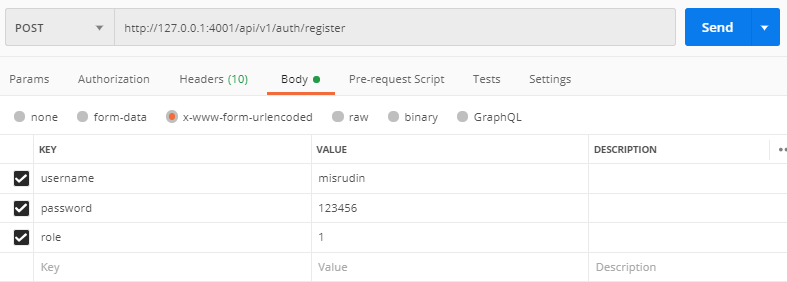  
    </div>
    <div class="items">
    	<h4 class="title-demo">Login</h4>
		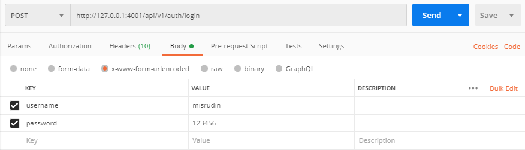
		<h6>Response success Login</h6>
		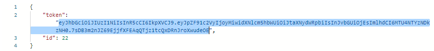
		<h6>Copy and Paste token into Headers</h6>
		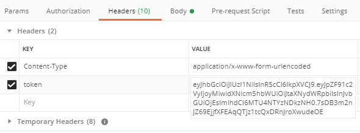
    </div>
     <div class="items">
    	<h4 class="title-demo">Category</h4>
		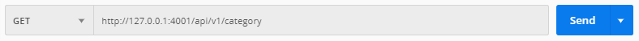  
		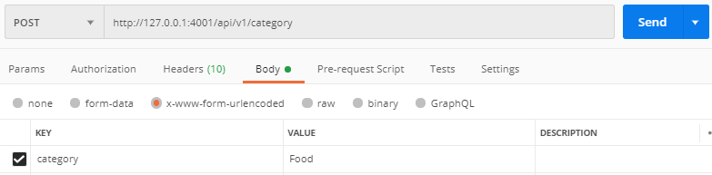  
		  
		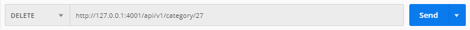  
    </div>
    <div class="items">
    	<h4 class="title-demo">Product</h4>
		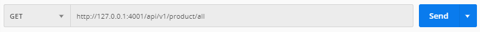
		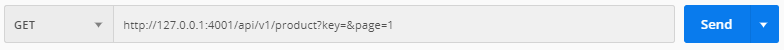    
		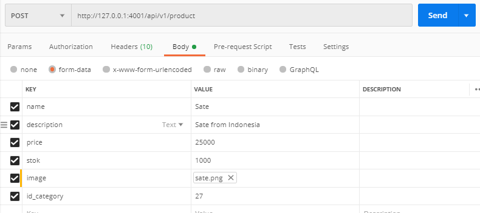  
		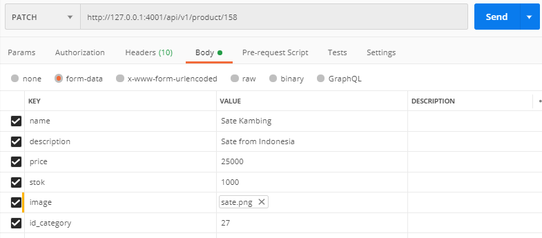  
		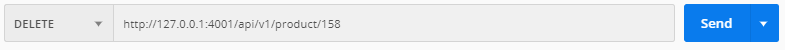  
    </div>
</div>
</section>


<section id="related-project">
	
## Related Project
* [`Hayuu-Cafe-FrontEnd`](https://github.com/misrudin/Front-end-PointOfSales.git)
* [`Hayuu-Cafe-Mobile`](https://github.com/misrudin/PosReactNative.git)
</section>

	